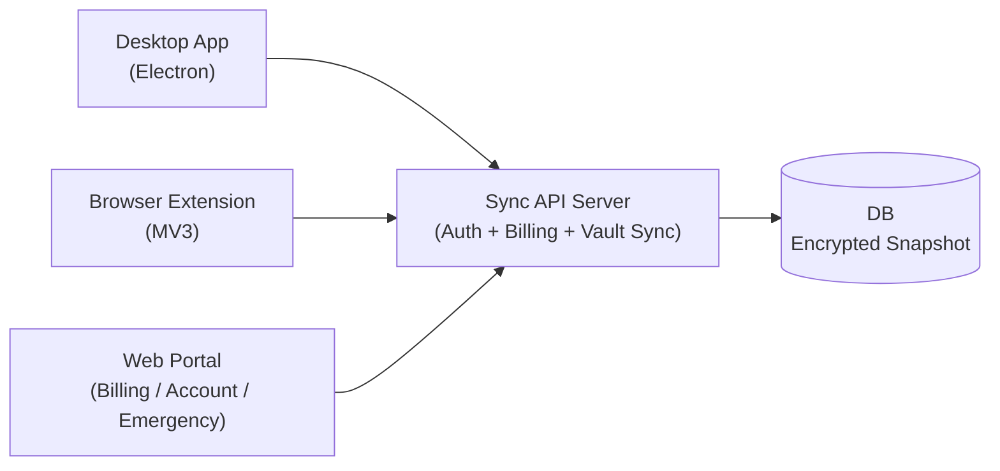

# PasswordManeger 詳細設計（ネイティブ主役 + 拡張併用 + Web補助）

## 0. 目的

この設計書は、次の3つを同時に満たすためのものです。

1. 日常利用の中心をネイティブアプリにする
2. ブラウザ上の自動入力は拡張機能で快適に使えるようにする
3. 課金・アカウント管理・緊急復旧はWebで完結できるようにする

---

## 1. 用語（初心者向け）

1. Vault（ボルト）: パスワードなどを保管する暗号化データ
2. E2EE: End-to-End Encryption。端末で暗号化し、サーバーは平文を見られない方式
3. KDF: Key Derivation Function。パスワードから鍵を作る処理
4. TOTP: 時間で変わるワンタイムコード（2段階認証）
5. Revision: 同期の世代番号。衝突検知に使う

---

## 2. 採用アーキテクチャ

### 2-1. なぜこの形にしたか

1. Desktop主役にすると、ブラウザ依存が減る
2. 拡張機能を残すと、自動入力体験を高品質にできる
3. Webを補助用途に限定すると、責務が分かりやすい

### 2-2. 他方式との比較

1. Webのみ
- メリット: 配布が簡単
- デメリット: 自動入力体験が弱い

2. 拡張機能のみ
- メリット: 実装が軽い
- デメリット: ネイティブ操作（OS統合）が弱い

3. 今回方式（採用）
- メリット: 使い勝手と拡張性のバランスが最も良い
- デメリット: 配布物が増える

---

## 3. レイヤー責務

### 3-1. Desktop

責務:
1. Vaultの作成/解錠/編集
2. パスワード生成・TOTP・診断
3. 移行インポート
4. クラウド同期（有料）

非責務:
1. WebページDOMへの自動入力（拡張機能担当）

### 3-2. Browser Extension

責務:
1. リスクベース自動入力（高リスク時ブロック/確認）
2. サイト別フォーム学習（誤学習リセット可能）
3. フォーム保存候補検出
4. ブラウザ内でのクイック操作

### 3-3. Web

責務:
1. 課金（Stripe Checkout / Portal）
2. アカウント状態確認
3. 緊急アクセス（暗号化スナップショット取得）
4. 緊急復旧オプション（鍵分割の作成/復元）

---

## 4. データ設計

### 4-1. クライアント内（復号後）

1. `vault.meta`: 作成/更新日時
2. `vault.settings`: 自動ロック、クリップボードクリア、生成設定
3. `vault.items[]`: `login | card | identity | note`

### 4-2. サーバー保存（暗号化）

1. `users`: 認証・エンタイトルメント状態
2. `vaults`: `userId`, `revision`, `envelope`, `updatedAt`

注意:
- `envelope` は暗号文とKDF情報のみ
- サーバーで平文復号はしない
- 有料判定は `users.entitlements[]` から計算する（購入元に依存しない）

---

## 5. セキュリティ設計

### 5-1. 暗号

1. KDF: PBKDF2-SHA256
2. 暗号: AES-GCM
3. IV: 毎回ランダム生成

採用理由:
1. Web/Electron両方で共通実装しやすい
2. 初期リリース速度を優先できる

デメリット:
1. PBKDF2はArgon2idより耐GPU性で劣る

将来拡張:
1. KDFバージョンフィールドを使ってArgon2id移行

### 5-2. ロック設計

1. 復号鍵はメモリのみ
2. 一定時間操作がなければ自動ロック
3. コピー情報は設定秒数でクリア

---

## 6. 同期設計

方式:
1. `revision` による楽観ロック
2. push時に `expectedRevision` を送る
3. 不一致なら `409` を返す

理由:
1. CRDTより実装が分かりやすい
2. 学習コストが低い

注意:
1. 同時編集が多い将来は差分同期/競合UIが必要

---

## 7. API設計

### 認証
1. `POST /api/auth/register`
2. `POST /api/auth/login`
3. `GET /api/auth/me`

### 課金
1. `POST /api/billing/checkout-session`
2. `POST /api/billing/portal-session`
3. `GET /api/billing/status`
4. `POST /api/billing/webhook`
5. `GET /api/entitlements/status`
6. `POST /api/entitlements/ingest`（サーバー間連携）

### 同期
1. `GET /api/vault/snapshot`
2. `PUT /api/vault/snapshot`

### 緊急アクセス
1. `GET /api/vault/emergency-export`

制御ルール:
1. 同期APIは有料ユーザーのみ
2. 緊急アクセスはログイン済みユーザーが実行可能

---

## 8. Stripe設計

必須値:
1. `STRIPE_SECRET_KEY`
2. `STRIPE_PRICE_ID`
3. `STRIPE_WEBHOOK_SECRET`

Webhookで扱うイベント:
1. `checkout.session.completed`
2. `customer.subscription.created`
3. `customer.subscription.updated`
4. `customer.subscription.deleted`

方針:
1. Stripe固有の `subscription.status` をそのまま機能判定に使わない
2. 一度 `entitlements` の共通ステータスへ正規化してから判定する
3. 将来の App Store / Google Play 連携も同じ `entitlements` に取り込む

---

## 9. エンタイトルメント（利用権）を1本化する設計（どこで買っても同じ機能）

### 9-1. まず「利用権（エンタイトルメント）」とは

利用権（Entitlement）は、ざっくり言うと「このユーザーが今、どの機能を使って良いか」を表す情報です。

例:
- 有料機能 = `cloud_sync`（クラウド同期）
- その有料機能が `active`（有効）なら、同期APIを使える

ポイント:
- **課金の種類（Stripe / App Store / Google Play）** と **使える機能** は同じではありません
- 課金の世界は複雑（試用期間/猶予期間/返金/チャージバックなど）なので、アプリ側は「使える/使えない」に集中した方が安全です

### 9-2. なぜ「1本化」が必要か

商用ソフトで「どこで買っても同じ機能」にするには、購入経路が増えます。

- Webで買う: Stripe
- iOSで買う: App Store（Apple）
- Androidで買う: Google Play

もし購入経路ごとに「この場合はA、あの場合はB…」と分岐を書き続けると、
- 条件が増えてバグが増える
- 返金や猶予期間などの例外が抜けやすい
- クライアント（Desktop/拡張/モバイル）すべてに同じ分岐を入れる羽目になる

ので、**サーバーで最終的な利用権だけを共通形式に正規化（= 1本化）** して、
クライアントは **「/api/entitlements/status の結果だけ見て動く」** ようにします。

### 9-3. 1本化のやり方（このリポジトリの方針）

サーバーのユーザーデータに、共通の配列 `entitlements[]` を持たせます。

1つの要素（利用権）は、次のような形です。

- `feature`: 使える機能（例: `cloud_sync`）
- `source`: どこで買ったか（例: `stripe`, `apple`, `google_play`, `manual`）
- `sourceRef`: 購入の参照ID（例: Stripeのsubscription id / ストアのtransaction id など）
- `status`: 正規化した状態（例: `active`, `trialing`, `grace_period`, `canceled`, `expired`, `revoked`, `inactive`）
- `expiresAt`: 期限（サブスクの次回更新期限など）。期限がない場合は `null`
- `updatedAt`: 最終更新時刻
- `metadata`: 将来のための追加情報

これを行っている場所:
- `server/src/entitlements.js`
- `server/src/store.js`（`upsertEntitlement()` で取り込み）

機能判定の考え方:
1. `entitlements[]` を全部正規化して並べる
2. `active` / `trialing` / `grace_period` のような「アクセス可能状態」が1つでもあれば有効
3. 複数の利用権がある場合は、優先度（active > trialing > grace…）と更新日時で「今の正」として採用する

この「どの利用権を採用するか」の計算が `summarizeFeatureAccess()` です。

### 9-4. 購入経路ごとの取り込みフロー

#### 9-4-1. Stripe（Web課金）

1. ユーザーがWebでCheckoutする
2. Stripe Webhookがサーバーに届く
3. Webhook内の情報（subscription status / current period end など）を **利用権へ正規化** して `entitlements[]` に保存する
4. 以後、同期APIは利用権で判定される

注意点:
- Webhookは「遅れて届く」「同じイベントが複数回届く」が起きます（なので取り込みは冪等にする）
  - 冪等（べきとう）= 同じ処理を何回しても結果が同じになるようにすること
- `past_due`（支払い遅延）などは「即停止」ではなく `grace_period` として扱い、体験を壊しすぎない設計にできます

#### 9-4-2. App Store / Google Play（アプリ内課金）

基本の考え方は同じです。

1. アプリ側で購入が成立する
2. サーバー側で「レシート/購入情報の検証」を行う（ストアの仕組みを使う）
3. 検証結果を `entitlements[]` に **同じ形式で取り込む**

このリポジトリでは、将来の取り込み口として
- `POST /api/entitlements/ingest`（サーバー間連携）

を用意しています。

ポイント:
- どの購入経路でも、最後は `entitlements[]` に落ちる
- だからクライアント側は購入経路を気にしないで済む

### 9-5. メリット / デメリット / 注意点

メリット:
1. 「購入経路が増えても、機能判定のコードが増えにくい」
2. クライアント（Desktop/拡張/モバイル）が同じロジックで動ける
3. 返金/解約/猶予期間などの例外をサーバー1箇所に集約できる

デメリット:
1. サーバーが必須になる（最低でも利用権の配布が必要）
2. Webhookやレシート検証など、バックエンド運用が増える
3. 「アカウント紐付け」設計が重要になる（購入とユーザーがズレると事故る）

注意点（事故りやすい所）:
1. Webhook遅延で「買ったのに反映されない」瞬間が起きる
   - 対策: UIに「反映に数十秒かかることがある」表示、手動更新ボタン、ポーリングなど
2. 返金/チャージバック（強制返金）時は `revoked` 扱いにする
3. `sourceRef` を適切に保存して「どの購入に紐づく利用権か」を追跡できるようにする

### 9-6. よくある別案との比較（なぜ今回方式が良いか）

別案A: 購入経路ごとに機能判定を分岐（Stripeならこれ、Appleならこれ…）
- メリット: 最初は速い
- デメリット: 増えるほど破綻しやすい。各クライアントに同じ分岐が散らばる

今回方式（採用）: 「利用権」に正規化して一本化
- メリット: 長期的に壊れにくい。購買経路が増えても影響を局所化できる
- デメリット: 最初からサーバー設計が必要

## 10. 移行設計（乗り換え重視）

対応:
1. 1Password CSV
2. Bitwarden CSV/JSON
3. LastPass CSV
4. 汎用CSV/JSON

方針:
1. 可能な限りログイン項目へ正規化
2. 重複はフィンガープリントでスキップ
3. 不完全データはノートへフォールバック
4. 実インポート前に差分プレビュー（追加/重複/形式不正）を表示

---

## 11. 配布設計

### Desktop

実装:
1. Electron
2. macビルド（arm64）
3. Windowsビルド（x64）

注意:
1. 現段階は署名なし
2. 商用配布前に署名証明書の整備が必要

### Extension

実装:
1. Manifest V3
2. Chromium系ブラウザ対応

---

## 12. テスト設計

1. Unit: 暗号・生成・TOTP・移行
2. Service Smoke: DesktopのVaultサービスをCLIで検証
3. API Smoke: 認証 + 緊急アクセス応答
4. Build Smoke: mac / win ビルド生成確認

---

## 13. 現在できること / まだできないこと

### できること
1. Desktop中心でVault運用
2. 拡張機能で自動入力
3. Stripe課金と有料同期
4. 緊急時に暗号化データ回収

### まだできないこと
1. 生体認証統合（Touch ID / Windows Hello）
2. Passkeyフル管理
3. 企業向け管理機能（SSO/SCIM/監査ログ）
