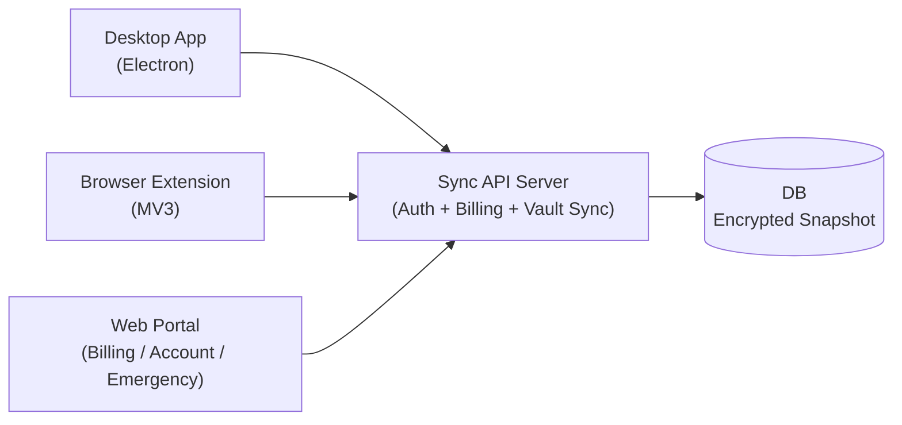

# PasswordManeger 詳細設計（ネイティブ主役 + 拡張併用 + Web補助）

## 0. 目的

この設計書は、次の3つを同時に満たすためのものです。

1. 日常利用の中心をネイティブアプリにする
2. ブラウザ上の自動入力は拡張機能で快適に使えるようにする
3. 課金・アカウント管理・緊急復旧はWebで完結できるようにする

---

## 1. 用語（初心者向け）

1. Vault（ボルト）: パスワードなどを保管する暗号化データ
2. E2EE: End-to-End Encryption。端末で暗号化し、サーバーは平文を見られない方式
3. KDF: Key Derivation Function。パスワードから鍵を作る処理
4. TOTP: 時間で変わるワンタイムコード（2段階認証）
5. Revision: 同期の世代番号。衝突検知に使う

---

## 2. 採用アーキテクチャ

### 2-1. なぜこの形にしたか

1. Desktop主役にすると、ブラウザ依存が減る
2. 拡張機能を残すと、自動入力体験を高品質にできる
3. Webを補助用途に限定すると、責務が分かりやすい

### 2-2. 他方式との比較

1. Webのみ
- メリット: 配布が簡単
- デメリット: 自動入力体験が弱い

2. 拡張機能のみ
- メリット: 実装が軽い
- デメリット: ネイティブ操作（OS統合）が弱い

3. 今回方式（採用）
- メリット: 使い勝手と拡張性のバランスが最も良い
- デメリット: 配布物が増える

---

## 3. レイヤー責務

### 3-1. Desktop

責務:
1. Vaultの作成/解錠/編集
2. パスワード生成・TOTP・診断
3. 移行インポート
4. クラウド同期（有料）

非責務:
1. WebページDOMへの自動入力（拡張機能担当）

### 3-2. Browser Extension

責務:
1. 自動入力
2. フォーム保存候補検出
3. ブラウザ内でのクイック操作

### 3-3. Web

責務:
1. 課金（Stripe Checkout / Portal）
2. アカウント状態確認
3. 緊急アクセス（暗号化スナップショット取得）

---

## 4. データ設計

### 4-1. クライアント内（復号後）

1. `vault.meta`: 作成/更新日時
2. `vault.settings`: 自動ロック、クリップボードクリア、生成設定
3. `vault.items[]`: `login | card | identity | note`

### 4-2. サーバー保存（暗号化）

1. `users`: 認証・課金状態
2. `vaults`: `userId`, `revision`, `envelope`, `updatedAt`

注意:
- `envelope` は暗号文とKDF情報のみ
- サーバーで平文復号はしない

---

## 5. セキュリティ設計

### 5-1. 暗号

1. KDF: PBKDF2-SHA256
2. 暗号: AES-GCM
3. IV: 毎回ランダム生成

採用理由:
1. Web/Electron両方で共通実装しやすい
2. 初期リリース速度を優先できる

デメリット:
1. PBKDF2はArgon2idより耐GPU性で劣る

将来拡張:
1. KDFバージョンフィールドを使ってArgon2id移行

### 5-2. ロック設計

1. 復号鍵はメモリのみ
2. 一定時間操作がなければ自動ロック
3. コピー情報は設定秒数でクリア

---

## 6. 同期設計

方式:
1. `revision` による楽観ロック
2. push時に `expectedRevision` を送る
3. 不一致なら `409` を返す

理由:
1. CRDTより実装が分かりやすい
2. 学習コストが低い

注意:
1. 同時編集が多い将来は差分同期/競合UIが必要

---

## 7. API設計

### 認証
1. `POST /api/auth/register`
2. `POST /api/auth/login`
3. `GET /api/auth/me`

### 課金
1. `POST /api/billing/checkout-session`
2. `POST /api/billing/portal-session`
3. `GET /api/billing/status`
4. `POST /api/billing/webhook`

### 同期
1. `GET /api/vault/snapshot`
2. `PUT /api/vault/snapshot`

### 緊急アクセス
1. `GET /api/vault/emergency-export`

制御ルール:
1. 同期APIは有料ユーザーのみ
2. 緊急アクセスはログイン済みユーザーが実行可能

---

## 8. Stripe設計

必須値:
1. `STRIPE_SECRET_KEY`
2. `STRIPE_PRICE_ID`
3. `STRIPE_WEBHOOK_SECRET`

Webhookで扱うイベント:
1. `checkout.session.completed`
2. `customer.subscription.created`
3. `customer.subscription.updated`
4. `customer.subscription.deleted`

---

## 9. 移行設計（乗り換え重視）

対応:
1. 1Password CSV
2. Bitwarden CSV/JSON
3. LastPass CSV
4. 汎用CSV/JSON

方針:
1. 可能な限りログイン項目へ正規化
2. 重複はフィンガープリントでスキップ
3. 不完全データはノートへフォールバック

---

## 10. 配布設計

### Desktop

実装:
1. Electron
2. macビルド（arm64）
3. Windowsビルド（x64）

注意:
1. 現段階は署名なし
2. 商用配布前に署名証明書の整備が必要

### Extension

実装:
1. Manifest V3
2. Chromium系ブラウザ対応

---

## 11. テスト設計

1. Unit: 暗号・生成・TOTP・移行
2. Service Smoke: DesktopのVaultサービスをCLIで検証
3. API Smoke: 認証 + 緊急アクセス応答
4. Build Smoke: mac / win ビルド生成確認

---

## 12. 現在できること / まだできないこと

### できること
1. Desktop中心でVault運用
2. 拡張機能で自動入力
3. Stripe課金と有料同期
4. 緊急時に暗号化データ回収

### まだできないこと
1. 生体認証統合（Touch ID / Windows Hello）
2. Passkeyフル管理
3. 企業向け管理機能（SSO/SCIM/監査ログ）

