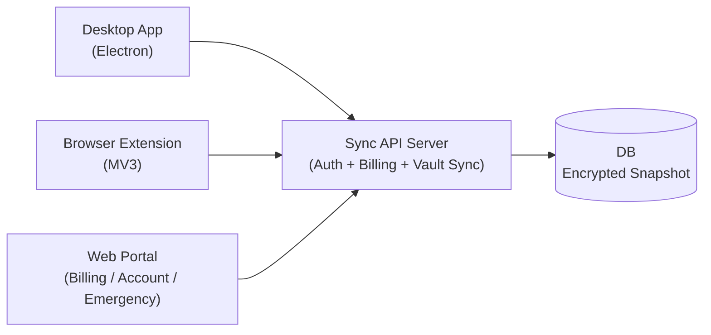

# PasswordManeger 詳細設計（ネイティブ主役 + 拡張併用 + Web補助）

## 0. 目的

この設計書は、次の3つを同時に満たすためのものです。

1. 日常利用の中心をネイティブアプリにする
2. ブラウザ上の自動入力は拡張機能で快適に使えるようにする
3. 課金・アカウント管理・緊急復旧はWebで完結できるようにする

---

## 1. 用語（初心者向け）

1. Vault（ボルト）: パスワードなどを保管する暗号化データ
2. E2EE: End-to-End Encryption。端末で暗号化し、サーバーは平文を見られない方式
3. KDF: Key Derivation Function。パスワードから鍵を作る処理
4. TOTP: 時間で変わるワンタイムコード（2段階認証）
5. Revision: 同期の世代番号。衝突検知に使う

---

## 2. 採用アーキテクチャ



### 2-1. なぜこの形にしたか

1. Desktop主役にすると、ブラウザ依存が減る
2. 拡張機能を残すと、自動入力体験を高品質にできる
3. Webを補助用途に限定すると、責務が分かりやすい

### 2-2. 他方式との比較

1. Webのみ
- メリット: 配布が簡単
- デメリット: 自動入力体験が弱い

2. 拡張機能のみ
- メリット: 実装が軽い
- デメリット: ネイティブ操作（OS統合）が弱い

3. 今回方式（採用）
- メリット: 使い勝手と拡張性のバランスが最も良い
- デメリット: 配布物が増える

### 2-3. AIネイティブ拡張（MCP）

MCP（Model Context Protocol）サーバーを追加し、AIがVault操作や同期処理を直接呼べるようにします。

採用理由:
1. 独自のAI連携APIを作るより、既存クライアント互換が高い
2. Desktopの既存ロジック（`DesktopVaultService`）を再利用できる
3. 「GUIでできること」と「AIでできること」の差分を小さくできる

比較:
1. 独自RESTだけをAIに叩かせる方式
- メリット: 実装が単純
- デメリット: ツール定義やスキーマ共有を自前で持つ必要がある
2. MCP方式（採用）
- メリット: ツールの入出力を構造化しやすく、AI実行環境に接続しやすい
- デメリット: MCP SDKの運用知識が少し必要

---

## 3. レイヤー責務

### 3-1. Desktop

責務:
1. Vaultの作成/解錠/編集
2. パスワード生成・TOTP・診断
3. 移行インポート
4. クラウド同期（有料）

非責務:
1. WebページDOMへの自動入力（拡張機能担当）

### 3-2. Browser Extension

責務:
1. リスクベース自動入力（高リスク時ブロック/確認）
2. サイト別フォーム学習（誤学習リセット可能）
3. フォーム保存候補検出
4. ブラウザ内でのクイック操作

#### 3-2-1. サイト別フォーム学習の仕組み（初心者向け）

「フォーム学習」は、サイトごとに“どの入力欄がユーザー名/パスワード欄なのか”を覚えて、次回の自動入力を当てやすくする仕組みです。

学習するデータ（何を覚えるか）:
1. ドメイン（例: `accounts.example.com`）
2. モード（`login / card / identity`）
3. 入力欄の特徴（`id / name / placeholder / aria-label / autocomplete / type` など）

学習のタイミング（いつ覚えるか）:
1. 自動入力に成功したとき、そのときに使った入力欄の特徴を保存します
2. さらにログインフォームは、送信（submit）のとき「実際に入力されていた欄」を保存します  
   つまり、最初にズレても手動で直して送信すれば、それが次回に反映されやすくなります

保存場所（どこに保存するか）:
- ブラウザの `chrome.storage.local`（端末内のローカル保存）  
  注意: ここには“欄の特徴”だけを保存し、パスワードなどの秘密値は保存しません

誤学習の対策:
- 「このサイトをリセット」「全学習をリセット」を用意して、いつでも戻せるようにします

他の一般的な方法との比較:
1. 固定ルールのみ（学習なし）
  - メリット: 実装が簡単
  - デメリット: サイトごとのクセに弱い（直しても次回またズレる）
2. CSSセレクタを保存（例: `#login input[name=email]` を丸ごと覚える）
  - メリット: 当たれば強い
  - デメリット: DOM変更に弱い（サイト更新で壊れやすい）
3. 今回方式（欄の“特徴”を複数覚えて照合）
  - メリット: DOMが少し変わっても当たりやすい
  - デメリット: 完璧ではないので、リセットと例外対応が必要

### 3-3. Web

責務:
1. 課金（Stripe Checkout / Portal）
2. アカウント状態確認
3. 緊急アクセス（暗号化スナップショット取得）
4. 緊急復旧オプション（鍵分割の作成/復元）

---

## 4. データ設計

### 4-1. クライアント内（復号後）

1. `vault.meta`: 作成/更新日時
2. `vault.settings`: 自動ロック、クリップボードクリア、生成設定
3. `vault.items[]`: `login | card | identity | note`

### 4-2. サーバー保存（暗号化）

1. `users`: 認証・エンタイトルメント状態
2. `vaults`: `userId`, `revision`, `envelope`, `updatedAt`

注意:
- `envelope` は暗号文とKDF情報のみ
- サーバーで平文復号はしない
- 有料判定は `users.entitlements[]` から計算する（購入元に依存しない）

---

## 5. セキュリティ設計

### 5-1. 暗号

1. KDF: PBKDF2-SHA256
2. 暗号: AES-GCM
3. IV: 毎回ランダム生成

採用理由:
1. Web/Electron両方で共通実装しやすい
2. 初期リリース速度を優先できる

デメリット:
1. PBKDF2はArgon2idより耐GPU性で劣る

将来拡張:
1. KDFバージョンフィールドを使ってArgon2id移行

### 5-2. ロック設計

1. 復号鍵はメモリのみ
2. 一定時間操作がなければ自動ロック
3. コピー情報は設定秒数でクリア

### 5-3. 認証・Webhookハードニング

1. `JWT_SECRET` は必須にし、固定デフォルト値を禁止する
2. `/api/auth/login` と `/api/auth/register` にレート制限を入れて総当たり耐性を上げる
3. Stripe Webhookは署名必須にする（ローカル検証時のみ `ALLOW_INSECURE_WEBHOOK=1` で例外）
4. クラウド認証トークンは平文で長期保存しない（Desktopはメモリ保持、拡張は `storage.session` 優先）

注意:
1. トークンを永続しない設計は安全性が上がる反面、再起動後の再ログインが必要になる

---

## 6. 同期設計

方式:
1. `revision` による楽観ロック
2. push時に `expectedRevision` を送る
3. 不一致なら `409` を返す

理由:
1. CRDTより実装が分かりやすい
2. 学習コストが低い

注意:
1. 同時編集が多い将来は差分同期/競合UIが必要

---

## 7. API設計

### 認証
1. `POST /api/auth/register`
2. `POST /api/auth/login`
3. `GET /api/auth/me`

### 課金
1. `POST /api/billing/checkout-session`
2. `POST /api/billing/portal-session`
3. `GET /api/billing/status`
4. `POST /api/billing/webhook`
5. `GET /api/entitlements/status`
6. `POST /api/entitlements/ingest`（サーバー間連携）

### 同期
1. `GET /api/vault/snapshot`
2. `PUT /api/vault/snapshot`

### 緊急アクセス
1. `GET /api/vault/emergency-export`

制御ルール:
1. 同期APIは有料ユーザーのみ
2. 緊急アクセスはログイン済みユーザーが実行可能

---

## 8. Stripe設計

必須値:
1. `STRIPE_SECRET_KEY`
2. `STRIPE_PRICE_ID`
3. `STRIPE_WEBHOOK_SECRET`

Webhookで扱うイベント:
1. `checkout.session.completed`
2. `customer.subscription.created`
3. `customer.subscription.updated`
4. `customer.subscription.deleted`

方針:
1. Stripe固有の `subscription.status` をそのまま機能判定に使わない
2. 一度 `entitlements` の共通ステータスへ正規化してから判定する
3. 将来の App Store / Google Play 連携も同じ `entitlements` に取り込む

---

## 9. エンタイトルメント（利用権）を1本化する設計（どこで買っても同じ機能）

### 9-1. まず「利用権（エンタイトルメント）」とは

利用権（Entitlement）は、ざっくり言うと「このユーザーが今、どの機能を使って良いか」を表す情報です。

例:
- 有料機能 = `cloud_sync`（クラウド同期）
- その有料機能が `active`（有効）なら、同期APIを使える

ポイント:
- **課金の種類（Stripe / App Store / Google Play）** と **使える機能** は同じではありません
- 課金の世界は複雑（試用期間/猶予期間/返金/チャージバックなど）なので、アプリ側は「使える/使えない」に集中した方が安全です

### 9-2. なぜ「1本化」が必要か

商用ソフトで「どこで買っても同じ機能」にするには、購入経路が増えます。

- Webで買う: Stripe
- iOSで買う: App Store（Apple）
- Androidで買う: Google Play

もし購入経路ごとに「この場合はA、あの場合はB…」と分岐を書き続けると、
- 条件が増えてバグが増える
- 返金や猶予期間などの例外が抜けやすい
- クライアント（Desktop/拡張/モバイル）すべてに同じ分岐を入れる羽目になる

ので、**サーバーで最終的な利用権だけを共通形式に正規化（= 1本化）** して、
クライアントは **「/api/entitlements/status の結果だけ見て動く」** ようにします。

### 9-3. 1本化のやり方（このリポジトリの方針）

サーバーのユーザーデータに、共通の配列 `entitlements[]` を持たせます。

1つの要素（利用権）は、次のような形です。

- `feature`: 使える機能（例: `cloud_sync`）
- `source`: どこで買ったか（例: `stripe`, `apple`, `google_play`, `manual`）
- `sourceRef`: 購入の参照ID（例: Stripeのsubscription id / ストアのtransaction id など）
- `status`: 正規化した状態（例: `active`, `trialing`, `grace_period`, `canceled`, `expired`, `revoked`, `inactive`）
- `expiresAt`: 期限（サブスクの次回更新期限など）。期限がない場合は `null`
- `updatedAt`: 最終更新時刻
- `metadata`: 将来のための追加情報

これを行っている場所:
- `server/src/entitlements.js`
- `server/src/store.js`（`upsertEntitlement()` で取り込み）

機能判定の考え方:
1. `entitlements[]` を全部正規化して並べる
2. `active` / `trialing` / `grace_period` のような「アクセス可能状態」が1つでもあれば有効
3. 複数の利用権がある場合は、優先度（active > trialing > grace…）と更新日時で「今の正」として採用する

この「どの利用権を採用するか」の計算が `summarizeFeatureAccess()` です。

### 9-4. 購入経路ごとの取り込みフロー

#### 9-4-1. Stripe（Web課金）

1. ユーザーがWebでCheckoutする
2. Stripe Webhookがサーバーに届く
3. Webhook内の情報（subscription status / current period end など）を **利用権へ正規化** して `entitlements[]` に保存する
4. 以後、同期APIは利用権で判定される

注意点:
- Webhookは「遅れて届く」「同じイベントが複数回届く」が起きます（なので取り込みは冪等にする）
  - 冪等（べきとう）= 同じ処理を何回しても結果が同じになるようにすること
- `past_due`（支払い遅延）などは「即停止」ではなく `grace_period` として扱い、体験を壊しすぎない設計にできます

#### 9-4-2. App Store / Google Play（アプリ内課金）

基本の考え方は同じです。

1. アプリ側で購入が成立する
2. サーバー側で「レシート/購入情報の検証」を行う（ストアの仕組みを使う）
3. 検証結果を `entitlements[]` に **同じ形式で取り込む**

このリポジトリでは、将来の取り込み口として
- `POST /api/entitlements/ingest`（サーバー間連携）

を用意しています。

ポイント:
- どの購入経路でも、最後は `entitlements[]` に落ちる
- だからクライアント側は購入経路を気にしないで済む

### 9-5. メリット / デメリット / 注意点

メリット:
1. 「購入経路が増えても、機能判定のコードが増えにくい」
2. クライアント（Desktop/拡張/モバイル）が同じロジックで動ける
3. 返金/解約/猶予期間などの例外をサーバー1箇所に集約できる

デメリット:
1. サーバーが必須になる（最低でも利用権の配布が必要）
2. Webhookやレシート検証など、バックエンド運用が増える
3. 「アカウント紐付け」設計が重要になる（購入とユーザーがズレると事故る）

注意点（事故りやすい所）:
1. Webhook遅延で「買ったのに反映されない」瞬間が起きる
   - 対策: UIに「反映に数十秒かかることがある」表示、手動更新ボタン、ポーリングなど
2. 返金/チャージバック（強制返金）時は `revoked` 扱いにする
3. `sourceRef` を適切に保存して「どの購入に紐づく利用権か」を追跡できるようにする

### 9-6. よくある別案との比較（なぜ今回方式が良いか）

別案A: 購入経路ごとに機能判定を分岐（Stripeならこれ、Appleならこれ…）
- メリット: 最初は速い
- デメリット: 増えるほど破綻しやすい。各クライアントに同じ分岐が散らばる

今回方式（採用）: 「利用権」に正規化して一本化
- メリット: 長期的に壊れにくい。購買経路が増えても影響を局所化できる
- デメリット: 最初からサーバー設計が必要

### 9-7. 実装上「どこで1本化されているか」（具体）

この設計が“机上の空論ではなく”実装として成立しているポイントを、初心者向けに噛み砕いて説明します。

1. サーバーのDB（`server/data/db.json`）に **`users[].entitlements[]`** が保存される
- ここが「購入経路をまたいだ、最終的な利用権」の置き場所です
- Stripe・将来のApp Store・将来のGoogle Playも、最後はここに同じ形式で入ります

2. Stripe Webhookは、Stripeのイベントを **`entitlements[]` へ正規化** して保存する
- 実装: `server/src/server.js` の `/api/billing/webhook`
- `customer.subscription.*` を受け取り、`mapStripeStatusToEntitlementStatus()` で共通ステータスへ変換します
- 変換後は `store.upsertEntitlement()` で `users[].entitlements[]` に保存します

3. サーバーが「有料かどうか」を判定するときは **Stripeの生ステータスを直接見ない**
- 実装: `server/src/auth.js` の `isPaidUser()`
- 中身は `canUseFeature(user, "cloud_sync")` で、`entitlements[]` を見て判定します

4. 同期APIは **利用権でガード** される
- 実装: `server/src/server.js` の `paidRequired()`
- `GET/PUT /api/vault/snapshot` は無料ユーザーだと `402 Payment Required` を返します

5. クライアント（Desktop/拡張/将来モバイル）は「購入経路」ではなく **`/api/entitlements/status` を見て動く**
- これにより、購入経路が増えてもクライアントの分岐が増えにくくなります

### 9-8. 将来「購入経路を増やす」時の最小手順

例: App Store（iOS）を追加したい場合。

1. iOSアプリで購入が成立したら、購入情報（レシート）をサーバーへ送る
2. サーバーでレシート検証を行い、成功したら `users[].entitlements[]` を更新する
3. 以降は Desktop/拡張/モバイル全てが **同じ `entitlements[]` を見て同じように機能解放** されます

このリポジトリでは、将来のストア連携の“取り込み口”として `POST /api/entitlements/ingest` を用意しています。
注意: これは「サーバー間連携」用途です。クライアントから直接叩くと悪用されるので、基本は使いません。


## 10. 移行設計（乗り換え重視）

対応:
1. 1Password CSV
2. Bitwarden CSV/JSON
3. LastPass CSV
4. 汎用CSV/JSON

方針:
1. 可能な限りログイン項目へ正規化
2. 重複はフィンガープリントでスキップ
3. 不完全データはノートへフォールバック
4. 実インポート前に差分プレビュー（追加/重複/形式不正）を表示

---

## 11. 配布設計

### Desktop

実装:
1. Electron
2. macビルド（arm64）
3. Windowsビルド（x64）

注意:
1. 現段階は署名なし
2. 商用配布前に署名証明書の整備が必要

### Extension

実装:
1. Manifest V3
2. Chromium系ブラウザ対応

---

## 12. テスト設計

1. Unit: 暗号・生成・TOTP・移行
2. Service Smoke: DesktopのVaultサービスをCLIで検証
3. API Smoke: 認証 + 緊急アクセス応答
4. Build Smoke: mac / win ビルド生成確認

---

## 13. 現在できること / まだできないこと

### できること
1. Desktop中心でVault運用
2. 拡張機能で自動入力
3. Stripe課金と有料同期
4. 緊急時に暗号化データ回収

### まだできないこと
1. 生体認証統合（Touch ID / Windows Hello）
2. Passkeyフル管理
3. 企業向け管理機能（SSO/SCIM/監査ログ）

---

## 14. ユーザーフロー（全体像）

ここでは「ユーザーが何をするか」を先に整理します。全体像が分かると、細部（暗号やAPI）が追いやすくなります。

### 14-1. 初回（ローカルのみで使う）

1. Desktop または 拡張機能を起動
2. 「マスターパスワード」を設定して Vault を作成
3. ログイン項目（URL/ユーザー名/パスワード）を登録
4. 日常利用: 検索・コピー・生成・TOTP表示

ポイント:
1. サーバー無しでも使えます（ローカル暗号化Vault）
2. ただし、複数端末で同じVaultを共有するにはクラウド同期が必要です

### 14-2. 初回（クラウド同期まで使う、有料）

1. Webポータルでアカウント登録
2. Web課金（Stripe Checkout）
3. Desktop/拡張でクラウドログイン
4. `push` でクラウドへ暗号化スナップショットを保存
5. 別端末で `pull` して同じVaultを復元

注意:
1. 同期は「差分」ではなく「スナップショット」です（後述）
2. 同じタイミングで別端末から編集すると衝突しやすいので、基本は「編集した端末でpush、他端末はpull」運用が安全です

### 14-3. 日常（ブラウザで自動入力）

1. 拡張ポップアップで「このサイト向け候補」を表示
2. 候補を選択して自動入力
3. 高リスク判定のときは「確認」が必要

### 14-4. 学習（手動修正を反映して精度を上げる）

1. 初回自動入力で、意図しない欄に入った場合は手動で直す
2. そのままログインフォームを送信（submit）
3. 送信時の“実際に入力されていた欄”を覚える
4. 次回から当たりやすくなる

注意:
1. 学習は万能ではないので「リセット」を必ず用意します
2. 学習データには秘密値（パスワードそのもの）は保存しません（欄の特徴だけ）

### 14-5. 移行（他ソフトからの乗り換え）

1. 既存ソフトでエクスポート（CSV/JSON）
2. Desktop/拡張でファイルを選ぶ
3. 差分プレビュー（追加/重複/不正）を確認
4. 実行

### 14-6. 緊急アクセス/緊急復旧（補助Web）

1. Webでログイン
2. 緊急アクセス: 暗号化スナップショットをダウンロード
3. 必要なら「復旧キー」を鍵分割（オプション）して保管

補足:
1. 緊急アクセスは「暗号化データの回収」です。復号（マスターパスワードで開く）はクライアント側で行います

---

## 15. UI仕様（画面とボタンの仕様）

「どこに何があるか」を仕様として固定しておくと、将来のUI変更でも機能が消えたことに気付きやすくなります。

### 15-1. Desktop（Electron）

画面は大きく3状態です。

1. セットアップ画面（初回のみ）
- 入力: `setup-password`（マスターパスワード）、`setup-confirm`（確認）
- 表示: パスワード強度（リアルタイム）
- 操作: 「表示/隠す」トグル
- 実行: 「Vaultを作成して開始」

2. 解錠画面（ロック時/起動時）
- 入力: `unlock-password`
- 操作: 表示/隠す
- 実行: 「解錠する」

3. メイン画面（解錠後）
- 左カラム: 基本操作/拡張導線/クラウド同期/移行
- 右カラム: アイテム編集・一覧・診断・設定

主要ボタン（期待する効果）:
1. 「ロック」: 復号鍵をメモリから破棄してロック状態へ戻す
2. 「暗号化バックアップ」: 暗号化Envelopeをファイルへ出力
3. 「復元」: 暗号化Envelopeを読み込んでローカルVaultを置換
4. 「拡張機能フォルダを開く」: 拡張機能の読み込み作業をしやすくする（開発/検証用）
5. 「Web課金ページを開く」: ブラウザで課金導線へ
6. 「緊急アクセス画面を開く」: ブラウザで緊急アクセス導線へ
7. 「登録/ログイン/ログアウト」: クラウド同期用の認証
8. 「クラウドから取得 / 送信」: pull/push
9. 「差分プレビュー」: 移行内容を事前確認
10. 「診断を更新」: セキュリティ診断の再計算
11. 「設定を保存」: auto-lock/clipboard clear
12. 「マスターパスワード変更」: 現在PWで解錠→新PWで再暗号化

よくある誤解（重要）:
1. `apps/desktop/src/renderer/index.html` をブラウザで直接開くと、`Desktop連携が見つかりません` と表示されます
- これは正常です。Desktopアプリは Electron の `preload` で `window.pmDesktop` を注入しているため、ブラウザには存在しません
- 正しい起動: `npm run desktop:dev` または `npm run dev:up`

### 15-2. ブラウザ拡張（Chrome Extension / MV3）

拡張ポップアップは次のタブ構造です。

1. 自動入力
- 「このサイト向け候補」: 現在タブのドメインに合うログイン項目を表示
- 「サイト別フォーム学習」: 学習状態の表示/リセット
- 「保存候補」: フォーム送信から検出した候補を表示（保存ボタンでVaultへ追加）

2. アイテム
- Desktopと同等のアイテム作成/編集/検索

3. 移行/同期
- 移行（差分プレビュー→適用）
- クラウド同期（登録/ログイン/push/pull）

4. 診断
- セキュリティ診断レポート + 改善優先度つきコーチ

5. 設定
- auto-lock/clipboard clear/生成設定

### 15-3. Web（課金・アカウント管理・緊急アクセス）

Webは「Vault編集」ではなく、次に絞ります。

1. 登録/ログイン
2. 課金（Checkout/Portal）
3. 利用権（entitlements）の表示
4. 緊急アクセス（暗号化スナップショット取得）
5. 緊急復旧オプション（鍵分割）

なぜ Web に Vault編集を置かないか:
1. 自動入力の中心は拡張機能
2. Vault編集はネイティブの方が扱いやすい
3. Webは攻撃面が広がりやすいので責務を絞る

---

## 16. データ仕様（Vault / Item / 学習データ）

### 16-1. Vault（復号後の形）

復号後のVaultは大きく次の形です（Desktop/拡張で共通）。

```json
{
  "version": 1,
  "meta": {
    "createdAt": "2026-02-14T00:00:00.000Z",
    "updatedAt": "2026-02-14T00:00:00.000Z"
  },
  "settings": {
    "autoLockMinutes": 10,
    "clipboardClearSeconds": 20,
    "generator": {
      "length": 20,
      "uppercase": true,
      "lowercase": true,
      "numbers": true,
      "symbols": true
    }
  },
  "items": []
}
```

### 16-2. Item（ログイン/カード/個人情報/ノート）

共通フィールド:
1. `id`（UUID）
2. `type`（`login|card|identity|note`）
3. `title`（必須）
4. `tags[]`（最大20）
5. `favorite`（お気に入り）
6. `createdAt` / `updatedAt` / `lastUsedAt`

ログイン（`type=login`）追加フィールド:
1. `username`
2. `password`（必須）
3. `url`
4. `otpSecret`（TOTPの種）
5. `passwordUpdatedAt`

カード（`type=card`）追加フィールド:
1. `cardHolder`
2. `cardNumber`
3. `cardExpiry`
4. `cardCvc`

個人情報（`type=identity`）追加フィールド:
1. `fullName`
2. `email`
3. `phone`
4. `address`

ノート（`type=note`）追加フィールド:
1. `notes`
2. `url`（任意）

注意:
1. 各フィールドは上限文字数で切り詰めます（巨大データの混入を防ぐため）
2. `url` は `https://` が無い場合に自動補完します

### 16-3. Vault Envelope（暗号化して保存する形）

「Envelope（封筒）」は、Vaultの平文を暗号化して保存するためのJSONです。

```json
{
  "version": 1,
  "kdf": {
    "algorithm": "PBKDF2",
    "hash": "SHA-256",
    "iterations": 310000,
    "salt": "base64..."
  },
  "cipher": {
    "algorithm": "AES-GCM",
    "iv": "base64...",
    "ciphertext": "base64..."
  },
  "updatedAt": "2026-02-14T00:00:00.000Z"
}
```

ポイント:
1. サーバーに置くのも、このEnvelopeだけです（平文Vaultは送らない）
2. `kdf` が入っているので、将来KDFを移行しても復号に必要な情報が残ります

### 16-4. フォーム学習データ（拡張のローカル保存）

目的:
1. “どの欄がユーザー名/パスワード欄か” をサイトごとに覚える

保存場所:
1. `chrome.storage.local`（ローカル端末内）

保存キー:
1. `domain::mode`（例: `accounts.example.com::login`）

保存内容（イメージ）:
```json
{
  "domain": "accounts.example.com",
  "mode": "login",
  "mapping": {
    "username": { "id": "email", "name": "email", "type": "email", "placeholder": "", "autocomplete": "username", "ariaLabel": "" },
    "password": { "id": "pass", "name": "pass", "type": "password", "placeholder": "", "autocomplete": "current-password", "ariaLabel": "" }
  },
  "fillCount": 3,
  "createdAt": "...",
  "updatedAt": "..."
}
```

重要:
1. パスワード文字列そのものは保存しません
2. DOMが変わると学習が効かないことがあるので、リセット導線が必須です

---

## 17. API仕様（HTTPの入出力を具体化）

「API」は、Desktop/拡張/将来モバイルがサーバーと通信するための約束（入力/出力）です。

### 17-1. 認証

1. `POST /api/auth/register`
- 入力: `{ email, password }`
- 成功: `201 { ok, token, user }`
- 失敗: `409`（既存）/ `422`（形式不正）

2. `POST /api/auth/login`
- 入力: `{ email, password }`
- 成功: `200 { ok, token, user }`
- 失敗: `401`（不一致）

3. `GET /api/auth/me`
- Header: `Authorization: Bearer <token>`
- 成功: `200 { ok, user }`

補足:
1. トークンはJWT（JSON Web Token）です
2. JWTは「署名されたメモ」みたいなもので、サーバーは改ざんチェックして本人確認します

### 17-2. 課金（Stripe）

1. `POST /api/billing/checkout-session`
- 成功: `{ ok, url }`（Stripe CheckoutのURL）
- Stripe未設定: `503 { ok:false, error }`

2. `POST /api/billing/portal-session`
- 成功: `{ ok, url }`（Billing PortalのURL）

3. `GET /api/billing/status`
- 成功: `{ ok, feature, planStatus, isPaid, currentPeriodEnd, activeSources, entitlements }`

### 17-3. 利用権（Entitlements）

1. `GET /api/entitlements/status`
- 成功: `{ ok, features: { cloud_sync: { isPaid, planStatus, ... } } }`

2. `POST /api/entitlements/ingest`（サーバー間連携）
- Header: `x-entitlement-token: <ENTITLEMENT_INGEST_TOKEN>`
- Body: `{ userId|email, source, sourceRef, status, feature, startedAt, expiresAt, metadata }`

### 17-4. Vault同期（有料）

1. `GET /api/vault/snapshot`
- 条件: 有料（`cloud_sync` がactive/trialing/grace）
- 成功: `{ ok, snapshot: { userId, revision, envelope, updatedAt } }`

2. `PUT /api/vault/snapshot`
- 条件: 有料
- 入力: `{ expectedRevision, nextRevision, envelope }`
- 成功: `{ ok, snapshot }`
- 衝突: `409 { ok:false, error, currentRevision }`

### 17-5. 緊急アクセス

1. `GET /api/vault/emergency-export`
- 成功: `{ ok, snapshot }`（暗号化Envelope）

---

## 18. アルゴリズム仕様（暗号/強度/自動入力/学習）

### 18-1. 暗号（E2EE）

1. KDF（鍵を作る）: PBKDF2-SHA256
2. 暗号: AES-GCM（認証付き暗号）
3. 鍵長: 256bit
4. Salt: 16byteランダム
5. IV: 12byteランダム

なぜ PBKDF2 を採用したか:
1. Web Crypto APIで標準対応している
2. Desktop（Node）でも同じロジックを共有できる

デメリット:
1. GPU耐性はArgon2idより弱い

対策（将来）:
1. Envelopeに `kdf` 情報を入れているので、バージョンアップでArgon2idへ移行可能

### 18-2. パスワード強度（リアルタイム表示）

目的:
1. ユーザーが「弱いまま保存」しないように、その場で気付けるようにする

判定要素（ざっくり）:
1. 長さ
2. 文字種（大文字/小文字/数字/記号）
3. 推測されやすいパターン（連番、キーボード配列、"password" 等）
4. 繰り返し（同じ文字の連打、同じ塊の繰り返し）

表示:
1. スコア（0〜100）
2. ラベル（Very Weak〜Very Strong）
3. 具体的な改善メッセージ（1文）

注意:
1. このスコアは「推測されにくさ」を大まかに見るものです
2. 過信せず、重要サービスは必ず2段階認証も使うべきです

### 18-3. リスクベース自動入力

目的:
1. フィッシング（偽サイト）に誤入力しない

主なリスク要因:
1. 保存URLのドメインと、現在ページのドメインが一致しない
2. HTTPSではない
3. Punycode（`xn--`）が含まれる
4. 似たドメイン（編集距離が小さい）
5. 初回のサイト（信頼回数が0）

動作:
1. `risk.level = high` はデフォルトブロック（ユーザー確認が必要）
2. 何度か成功すると「信頼」が蓄積され、同じサイトではリスクを下げる

注意:
1. これは“完全な検知”ではなくヒューリスティック（経験則）です
2. 公的なPublic Suffix List（PSL）を入れると精度は上がりますが、更新コストが増えるため最初は軽量実装にしています

### 18-4. サイト別フォーム学習

やること:
1. 自動入力したとき「どの欄に入れたか」を記録
2. 送信（submit）時に「最終的にユーザーが正した欄」を記録
3. 次回は、その欄を優先して当てる

学習の安全策:
1. 秘密値は保存しない
2. ドメイン+モードで分離
3. リセットを用意

---

## 19. セキュリティ（守れること/守れないこと）

パスワードマネージャーは「万能な金庫」ではありません。何を守れるかを先に明確にします。

### 19-1. 守れること（この設計で強い）

1. サーバー流出: サーバーには暗号化Envelopeしかないため、平文Vaultを直接は抜けません（E2EE）
2. 通信盗聴: HTTPS前提 + トークン認証
3. 課金状態の混乱: 利用権を正規化して一本化しているため、購入経路の分岐が増えにくい

### 19-2. 守れないこと（限界）

1. 端末がマルウェアに感染している場合
- キーロガー、画面キャプチャ、メモリ読み取りは防げません

2. マスターパスワードを忘れた場合
- E2EEなので、サーバー側で復号して助けることはできません

3. フィッシングサイトでユーザーが手動で入力した場合
- リスクベース自動入力は“自動入力の安全性”を上げますが、手動入力の誤りまでは止められません

### 19-3. 秘密情報の取り扱い（運用ルール）

1. StripeキーやJWT_SECRETはGitにコミットしない
2. `.env` は `.gitignore` し、必要なら秘密管理（例: 1Password/Secrets Manager）を使う
3. テストキー（`sk_test_...`）でも公開は避ける
- 理由: アカウント内のテストデータを荒らされたり、Webhook/ログがノイズだらけになる可能性があります

---

## 20. テスト/CI（"確実に壊れてない" を強くする）

### 20-1. ローカルで回す「品質ゲート」

`npm run test:full` が、最低限の“壊れてない”をまとめて確認します。

内訳:
1. `npm test`（ユニットテスト）
2. `npm run test:mcp`（MCPのスモークテスト）
3. `npm run test:e2e:extension`（拡張込みE2E: 自動入力→送信→学習）
4. `npm run test:stripe:demo`（Stripe導線のスモーク）

### 20-2. GitHub Actions で自動実行する意味

「GitHub Actions」は、GitHub上で自動テストを走らせる仕組みです。

push時に `test:full` を回すと何が嬉しいか:
1. 自分のPC環境の差を受けにくい（クリーン環境で毎回確認できる）
2. pushした時点で「少なくともテストは通る」状態を保ちやすい
3. 将来チーム開発になっても壊れた変更が混ざりにくい

このリポジトリでは既に `.github/workflows/test-full.yml` で実行するよう設定済みです。

---

## 21. 配布/署名（商用リリースに向けた現実的な道筋）

### 21-1. Desktop（mac / Windows）

1. ビルド: Electron Builder（`apps/desktop`）
2. 署名:
- mac: Developer ID 署名 + Notarization（Appleの公証）
- Windows: コード署名証明書で署名

このリポジトリの現状:
1. ローカル試用向けに ad-hoc 署名スクリプトを用意（macのみ）
2. 商用署名は「証明書」が必要なので、手元の証明書が揃った段階で設定します

注意:
1. 署名は“見た目の安心”ではなく、配布で弾かれないための必須作業です
2. 署名無し配布は警告が出る/起動しないことがあります

### 21-2. 拡張機能

1. Chrome Web Store 等で配布する場合、審査があります
2. MV3は権限が厳しめなので、必要最小限の権限に絞るのが基本です

---

## 22. 既知の制限と今後の拡張（マルチプラットフォームの完成形へ）

### 22-1. 現状の制限

1. 同期がスナップショット（差分マージ無し）なので、同時編集の競合解決UIがない
2. 生体認証（Touch ID / Windows Hello）統合が未実装
3. Passkeyのフル管理が未実装
4. モバイルアプリ（iOS/Android）は未実装

### 22-2. モバイルをどう実装するか（方針案）

現時点では未実装ですが、選択肢は主に次です。

1. ネイティブ（Swift/Kotlin）
- メリット: OSの自動入力や鍵管理に最適。セキュリティ面の自由度が高い
- デメリット: 2つのコードベース（iOS/Android）で学習コストが高い

2. React Native
- メリット: JavaScript資産を活かしやすい。UIも比較的速く作れる
- デメリット: OSの自動入力連携は結局ネイティブ実装が必要になりがち

3. Flutter
- メリット: UIが揃いやすい。1コードでiOS/Android
- デメリット: 既存JS資産の再利用は弱い。暗号やOS連携の橋渡しが必要

結論（現段階の方針）:
1. まずは Desktop + 拡張 + Web（課金/復旧）で商用リリースに必要な中核を固める
2. モバイルは、OS自動入力（iOS Autofill / Android Autofill）を最優先に設計し、選択肢を確定する

---

## 23. レビュー用チェックリスト（抜け漏れ防止）

ユーザーが文章レビューしやすいように、確認ポイントをチェックリスト化します。

### 23-1. プロダクト仕様

1. Desktop/拡張/Webの責務が混ざっていないか
2. 「無料でできること」と「有料でできること」が明確か
3. 乗り換え（移行）導線が現実的か

### 23-2. セキュリティ

1. サーバーに平文Vaultが保存されない（E2EE）設計になっているか
2. トークン/Stripeキーなど秘密情報がコミットされない運用になっているか
3. Webhook署名が必須で、ローカル例外が明示されているか
4. 自動入力の高リスクがデフォルトブロックになっているか

### 23-3. 課金・利用権

1. 利用権（entitlements）が購入経路に依存せず1本化されているか
2. 同期APIが利用権でガードされているか
3. Webhook遅延/二重配信に耐える設計（冪等）になっているか

### 23-4. 品質

1. `npm run test:full` が通るか
2. GitHub Actions で `test:full` が回る設定か
3. 拡張込みE2Eで「学習が効く」ことを確認できるか
