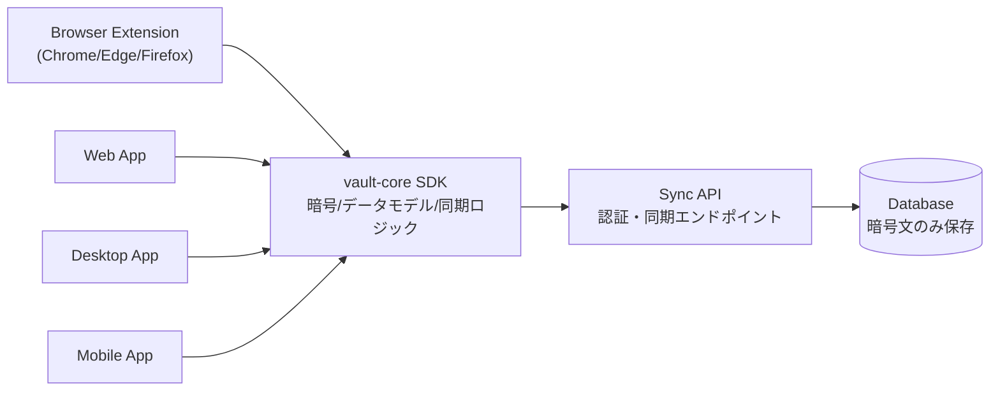

# PasswordManeger 詳細設計（拡張機能単体 + マルチプラットフォーム連携）

## 0. この設計書の目的

この設計書は、次の2つを同時に満たすための設計です。

1. **拡張機能だけでも今すぐ使えること**
2. **後から本体アプリ連携で真のマルチプラットフォームに拡張できること**

補足:
- 本体アプリ = Web / Desktop / Mobile クライアント
- 「真のマルチプラットフォーム」= どの端末でも同じVaultを安全に使えること

---

## 1. ゴールと非ゴール

### 1-1. ゴール（目標）

1. 拡張機能単体で、ログイン保存・自動入力・生成・監査が使える
2. 連携モードで、端末間同期（暗号化済みデータ同期）が使える
3. 1Password系の主要体験を段階的に実装できる構成にする

### 1-2. 非ゴール（今回すぐはやらない）

1. 企業向けの高度管理（SSO, SCIM, 細粒度監査）
2. 完全なPasskey管理のフル実装
3. すべてのWebサイトで100%自動入力成功

理由:
- 最初から全機能を詰め込むと、複雑になり学習コストが上がるため

---

## 2. 用語（初心者向け）

1. **Vault（ボルト）**: パスワード等を入れる暗号化保管庫
2. **E2EE**: End-to-End Encryption。端末で暗号化し、サーバーでは平文を見れない方式
3. **KDF**: Key Derivation Function。パスワードから暗号鍵を作る処理
4. **AES-GCM**: 暗号アルゴリズム（速く実用実績が高い）
5. **TOTP**: 時間で変わるワンタイムコード（2段階認証）
6. **MV3**: Chrome拡張機能の新しい仕様（Manifest V3）

---

## 3. 方式: 2モード設計

## 3-1. 単体モード（拡張機能のみ）

概要:
- データはブラウザ内（`chrome.storage.local`）に暗号化して保存
- サーバーなしで利用可能

メリット:
- すぐ使える
- 構成が単純

デメリット:
- 端末間同期ができない
- ブラウザプロファイル障害時にデータ喪失リスクがある（バックアップ必須）

## 3-2. 連携モード（本体アプリ + 同期サーバー）

概要:
- 拡張機能/Web/Desktop/Mobileが同じVaultを同期
- サーバーには暗号文のみ保存（E2EE）

メリット:
- 真のマルチプラットフォーム運用が可能
- 端末紛失時の復元が容易

デメリット:
- サーバー運用コストがかかる
- 認証・同期設計が複雑

比較してこの方式を採用する理由:
- 「今すぐ使える」と「将来拡張」を両立できるため

---

## 4. 全体アーキテクチャ



設計判断:
- 暗号処理を`vault-core SDK`に共通化する

理由:
- クライアントごとの差異を減らせる
- バグ修正が1か所で済む

代替案:
- 各クライアントで個別実装

代替案の問題:
- 同期不整合、バグ重複、保守コスト増大

---

## 5. リポジトリ構成（目標）

```text
PasswordManeger/
  apps/
    extension/
    web/
    desktop/
    mobile/
  services/
    sync-api/
  packages/
    vault-core/
    shared-types/
  docs/
```

補足:
- 現在は拡張機能先行構成だが、上記へ段階的に移行する

---

## 6. データモデル詳細

## 6-1. クライアント内部モデル（復号後）

### Vault
- `id: string`
- `name: string`
- `ownerUserId: string`
- `settings: VaultSettings`
- `items: VaultItem[]`
- `revision: number`

### VaultItem（共通）
- `id: string`
- `type: "login" | "card" | "identity" | "note"`
- `title: string`
- `tags: string[]`
- `favorite: boolean`
- `createdAt: string`
- `updatedAt: string`
- `lastUsedAt: string | null`

### LoginItem
- `username`
- `password`
- `url`
- `otpSecret`
- `passwordUpdatedAt`

### CardItem
- `cardHolder`
- `cardNumber`
- `cardExpiry`
- `cardCvc`

### IdentityItem
- `fullName`
- `email`
- `phone`
- `address`

### NoteItem
- `notes`

設計判断:
- まずは「少数の明確な型」に限定

理由:
- 初学者でも追いやすい
- バリデーション（入力検証）が簡単

---

## 6-2. サーバー保存モデル（暗号文）

サーバーDBは平文を持たない。

### users
- `id`
- `email`
- `password_hash`（ログイン用。Vault鍵とは別）
- `created_at`

### devices
- `id`
- `user_id`
- `device_name`
- `public_key`（デバイス識別・将来拡張用）
- `last_seen_at`

### vaults
- `id`
- `owner_user_id`
- `name`
- `created_at`

### vault_snapshots
- `vault_id`
- `revision`
- `encrypted_blob`
- `cipher_meta`（nonce/algorithm情報）
- `updated_by_device_id`
- `updated_at`

### vault_members
- `vault_id`
- `user_id`
- `role`（owner/editor/viewer）

設計判断:
- サーバーは暗号文スナップショットを保存

メリット:
- 実装が分かりやすく、E2EEを保ちやすい

デメリット:
- 将来の細かい差分同期は追加実装が必要

---

## 7. セキュリティ設計

## 7-1. 鍵設計

1. マスターパスワード入力
2. KDFで`Master Key`生成
3. `Master Key`でVaultデータを暗号化/復号

推奨:
- 連携モードでは`Argon2id`（メモリ耐性が高い）
- 拡張機能単体では実装難易度を見て`PBKDF2`から開始

なぜPBKDF2開始か:
- ブラウザ標準APIで扱いやすい
- 先に機能完成度を上げられる

注意:
- 将来はArgon2id移行を前提にバージョン管理を入れる

## 7-2. 暗号方式

- `AES-256-GCM` を使用
- 項目単位またはVault単位で暗号化
- 乱数（nonce/iv）は毎回新規生成

## 7-3. ロック/解除

- 非アクティブ一定時間で自動ロック
- 復号鍵はメモリのみ保持（永続保存しない）
- クリップボードは設定秒数で自動消去

---

## 8. 同期設計（連携モード）

## 8-1. 同期方式

- 方式: **リビジョン番号方式**（`revision`）
- クライアントは`lastKnownRevision`を持つ
- 更新時に`If-Match`相当で衝突検知

### 衝突時の方針

1. push失敗時、最新スナップショットをpull
2. ローカル変更と比較してマージ
3. 自動で解決できない場合は`conflict copy`を生成

なぜこの方式か:
- CRDT（複雑な分散同期アルゴリズム）より学習しやすい
- 実装難易度と保守性のバランスが良い

---

## 9. API設計（連携モード）

## 9-1. 認証API

1. `POST /v1/auth/register`
2. `POST /v1/auth/login`
3. `POST /v1/auth/refresh`
4. `POST /v1/auth/logout`

## 9-2. デバイスAPI

1. `POST /v1/devices`
2. `GET /v1/devices`
3. `DELETE /v1/devices/:deviceId`

## 9-3. Vault同期API

1. `GET /v1/vaults`（参加Vault一覧）
2. `GET /v1/vaults/:vaultId/snapshot`
3. `PUT /v1/vaults/:vaultId/snapshot`（`expectedRevision`必須）
4. `POST /v1/vaults/:vaultId/members`（共有）

### `PUT /snapshot` リクエスト例

```json
{
  "expectedRevision": 42,
  "nextRevision": 43,
  "encryptedBlob": "base64...",
  "cipherMeta": {
    "algorithm": "AES-256-GCM",
    "iv": "base64..."
  }
}
```

エラー仕様（例）:
- `409 CONFLICT`: リビジョン衝突
- `401 UNAUTHORIZED`: 認証失効
- `422 VALIDATION_ERROR`: 形式不正

---

## 10. クライアント仕様

## 10-1. 拡張機能

主要機能:
1. サイト候補表示
2. 自動入力（login/card/identity）
3. フォーム送信検知による保存提案
4. 単体モード/連携モード切替

注意点:
- サイトHTML差異により自動入力精度は一定でない
- 失敗時は手動選択UIを用意

## 10-2. Webアプリ

主要機能:
1. Vault管理
2. 全アイテム編集
3. セキュリティダッシュボード
4. デバイス管理

## 10-3. Desktop / Mobile

主要機能:
1. オフライン編集
2. 次回オンライン時に同期
3. 生体認証でロック解除（対応OSのみ）

---

## 11. 1Password相当機能の実装マップ

## Phase 1（拡張単体完成）

1. Vault作成/解錠/ロック
2. Login/Card/Identity/Note管理
3. 自動入力
4. パスワード生成
5. TOTP
6. セキュリティ監査（弱い/再利用/古い）
7. 暗号化バックアップ

## Phase 2（連携基盤）

1. アカウント登録/ログイン
2. 同期API
3. Webクライアント
4. 複数端末同期
5. 共有Vault基礎

## Phase 3（高度機能）

1. Passkey対応
2. 添付ファイル暗号化管理
3. 漏えい検知連携
4. 詳細監査ログ

---

## 12. 差別化機能（提案）

1. **改善優先度付きセキュリティコーチ**
- 問題一覧だけでなく「次に何を直すべきか」を順番表示

2. **サイト別フォーム学習**
- ユーザーの手動修正を記録し、次回自動入力精度を改善

3. **復旧ガイド付きバックアップ**
- バックアップ作成と復元手順を同時表示し、事故率を下げる

比較:
- 一般的なマネージャーは検出までで終わることが多い
- 本設計は「改善行動」まで導く点を差別化する

---

## 13. 失敗時の設計（運用上の注意）

1. 復号失敗時:
- ロックを維持し、再入力を促す
- 失敗回数をローカル制御（過度な連続試行を抑止）

2. 同期衝突時:
- データを消さずconflict copyを作る

3. インポート失敗時:
- 既存Vaultを上書きしない（一時領域で検証後反映）

---

## 14. テスト設計

1. Unit Test
- 暗号化/復号
- KDFパラメータ
- 生成器/TOTP/監査ロジック

2. Integration Test
- 単体モード: 保存→再起動→解錠
- 連携モード: 同期push/pull、衝突処理

3. E2E Test
- 主要ログインサイト風フォームで自動入力確認

4. Security Test
- 乱数再利用がないか
- 誤った鍵で復号できないか

---

## 15. 実装優先順位（次アクション）

1. 既存拡張機能をPhase 1完了まで固定（品質上げ）
2. `packages/vault-core`切り出し
3. `services/sync-api`作成（最低限API）
4. Webクライアント作成
5. 連携モード実装

---

## 16. 現時点で「できること / まだできないこと」

できること（現行実装ベース）:
1. 拡張機能単体でのVault利用
2. 保存・検索・自動入力・生成・簡易監査

まだできないこと:
1. デバイス間リアルタイム同期
2. 共有Vault本実装
3. Passkeyフル管理

以上の差分を埋めるための設計が本書です。
